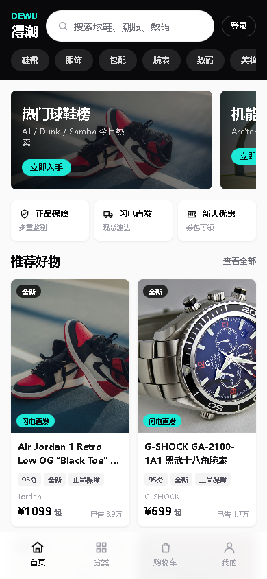
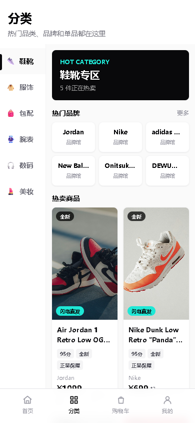
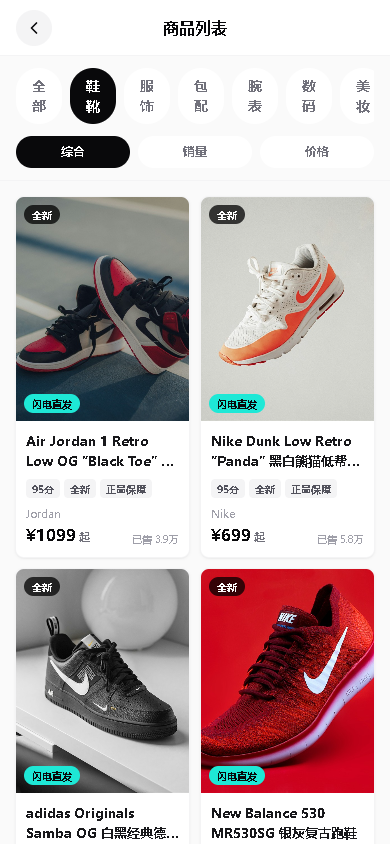
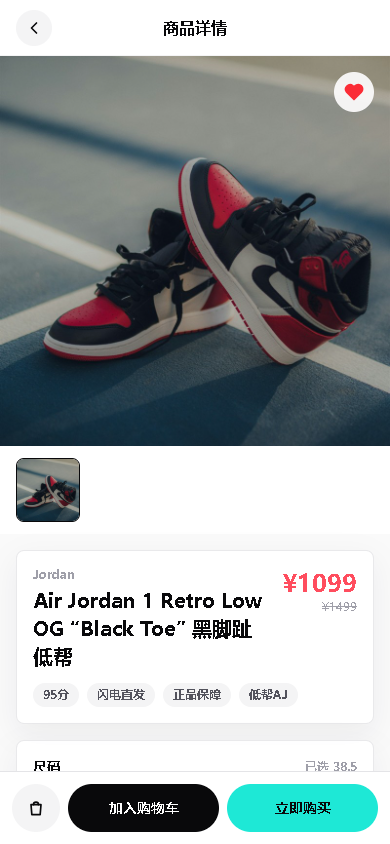
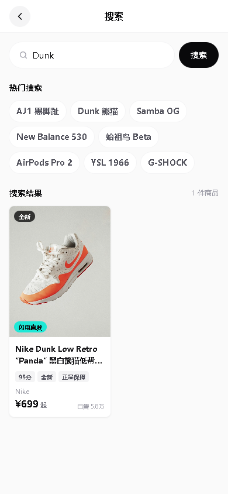
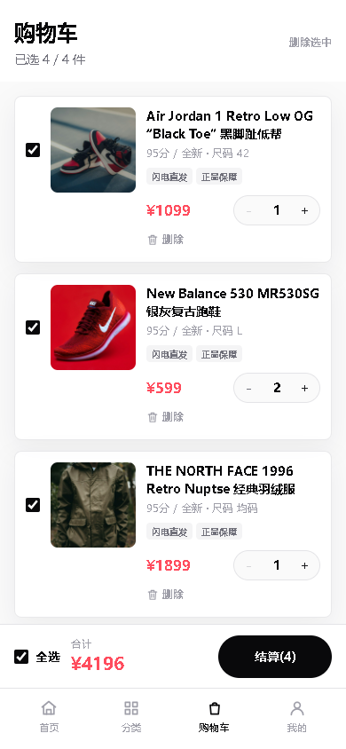
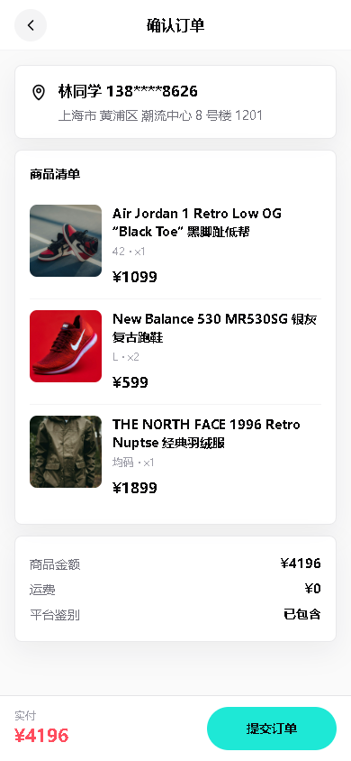
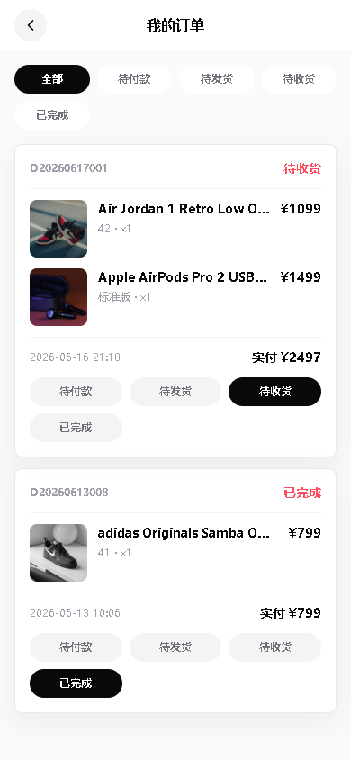
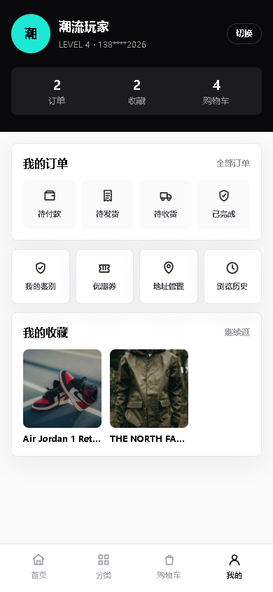
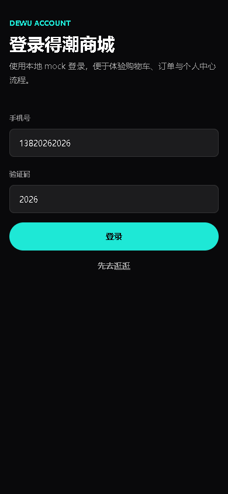

# dewu-mall-front

## 项目简介

dewu-mall-front 是一个基于 Vue 3、Vite 和 TailwindCSS 开发的移动端电商前端课程设计项目。项目参考得物 App 的电商视觉风格，采用移动端优先布局，包含首页、分类、商品列表、商品详情、搜索、购物车、订单和个人中心等完整页面流程。

项目不依赖后端服务，商品、购物车、订单和用户相关数据均通过本地 mock 数据与 LocalStorage 模拟，适合作为前端课程大作业提交与展示。

## 技术栈

- Vue 3
- Vite
- Vue Router
- TailwindCSS
- JavaScript
- LocalStorage
- 本地 mock 数据

## 页面功能

- 首页：顶部搜索栏、横向分类 Tab、正品保障服务标签、Banner、商品瀑布流。
- 分类页：左侧分类栏、右侧品牌宫格和分类商品展示。
- 商品列表页：按分类和关键词展示商品，支持综合、销量、价格排序。
- 商品详情页：商品图片、价格、标签、尺码选择、收藏、加入购物车和立即购买。
- 搜索页：关键词搜索、热门搜索点击填入、搜索结果实时筛选。
- 购物车页：商品勾选、全选、数量加减、删除商品、底部结算栏。
- 订单确认页：收货地址、商品清单、金额汇总、提交订单。
- 我的订单页：订单卡片展示、订单状态筛选和切换。
- 个人中心页：用户信息、订单入口、我的鉴别、优惠券、地址管理、浏览历史等入口。
- 登录页：本地模拟登录流程。

## 运行步骤

安装依赖：

```bash
npm install
```

启动开发环境：

```bash
npm run dev
```

启动成功后，根据终端提示访问本地地址，通常为 `http://127.0.0.1:5173/`。

生产环境构建：

```bash
npm run build
```

可选：本地预览生产环境构建结果：

```bash
npm run preview
```

## 项目结构

```text
dewu-mall-front/
├─ public/
│  └─ images/
│     └─ products/        # 本地商品图片资源
├─ screenshots/           # 项目页面截图
├─ src/
│  ├─ components/         # 公共组件
│  ├─ layouts/            # 页面布局
│  ├─ mock/               # 本地 mock 数据
│  ├─ pages/              # 页面视图
│  ├─ router/             # Vue Router 配置
│  ├─ stores/             # 本地状态管理
│  ├─ App.vue
│  ├─ main.js
│  └─ style.css
├─ index.html
├─ package.json
└─ vite.config.js
```

## 项目截图

### 首页


### 分类页


### 商品列表页


### 商品详情页


### 搜索页


### 购物车页


### 订单确认页


### 我的订单页


### 个人中心页


### 登录页


## 说明

- 当前项目为纯前端课程设计项目。
- 数据来自 `src/mock/data.js`。
- 商品、购物车、收藏、订单、用户信息等通过本地 mock 数据和 LocalStorage 模拟。
